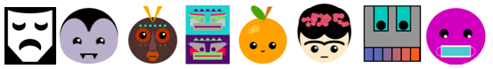

<h2 class="c-project-heading--task">Choose a background colour</h2>

➡️ Think of an idea for the kind of face or mask you want to make.

<h2 class="c-project-heading--explainer">Follow these instructions</h2>

➡️ Set up your image by choosing a background colour.
 

The three numbers in `background(0, 0, 0)` are red, green and blue values. Experiment with changing the numbers to any whole number between 0 and 255 to change the background colour. 

--- code ---
---
language: python
line_numbers: true
line_number_start: 10
line_highlights: 12
---
 
def draw():   
    # Put code to run every frame here
    background(0, 0, 0)    
  
--- /code ---

## Now run your code

You should see a coloured square.

### Tip

For a white background, choose `background(255, 255, 255)`.

Confirm the observable result.
