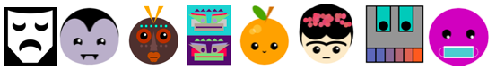
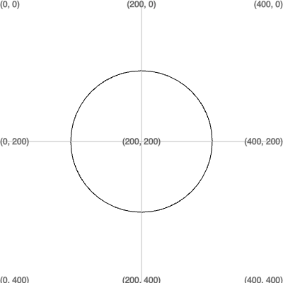

<h2 class="c-project-heading--task">Face shape</h2>

--- task ---
Draw and colour a shape for your face or mask. 

{:width="200px"}
--- /task --- 
 

Add code to the `draw()` function to draw the outline of a face.

--- code ---
---
language: python
line_numbers: true
line_number_start: 10
line_highlights: 14
---

def draw():
    # Put code to run every frame here
    background(255, 255, 255)  
    # Add code to draw your face here
    ellipse(screen_size/2, screen_size/2, 200, 200)  
  
--- /code ---

**Test:** Run your code and you should see a coloured square. 

