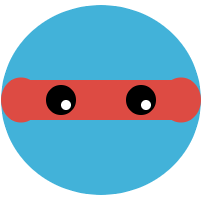

<h2 class="c-project-heading--task">Create your face</h2>

--- task ---
Now it is over to you! Use the skills you have learned to draw shapes and create a face. 

--- /task --- 

### Tip
Here are some examples for inspiration

{:width="150px"}
{:width="150px"}
{:width="150px"}
{:width="150px"}

