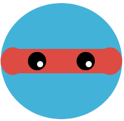
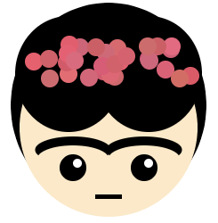
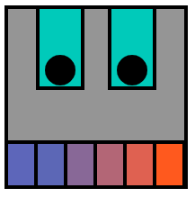
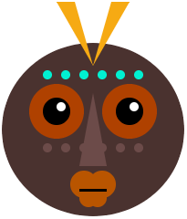
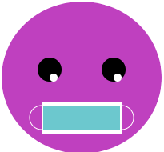
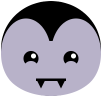

<h2 class="c-project-heading--task">Create your face</h2>

Now it is over to you!

<h2 class="c-project-heading--explainer">Follow these instructions</h2>

➡️ Use the skills you have learned to draw shapes and create a face. 

### Tip

Here are some examples for inspiration

{:width="150px"}
{:width="150px"}
{:width="150px"}
{:width="150px"}
{:width="150px"}
{:width="150px"}

## Now run your code

Confirm the observable result.
